# How to use Pilar Compass

This is the student and admin walkthrough. Demo accounts ship with the app so you can click every screen without a real school database.

Live demo: [pilar-compass.vercel.app](https://pilar-compass.vercel.app)

## 1. Unlock the gate

The first screen asks for a school email. Only addresses that end with the configured domain work (default: `@pilar.sch.id`).

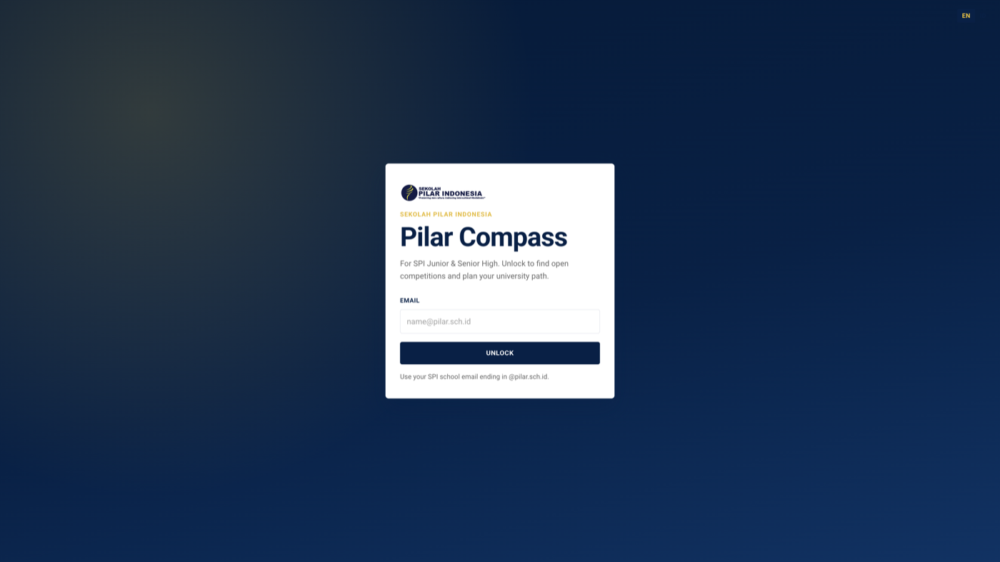

| Account | What you get |
|---------|----------------|
| `admin@pilar.sch.id` | Admin nav + school dashboard, and every student tool |
| `rina.12-rio-de-janeiro@pilar.sch.id` | Seeded Grade 12 student already onboarded |
| Any other `@pilar.sch.id` address | New visitor — complete TKA onboarding once |

There is no password. This is a school-domain unlock stored in the browser, not a full auth provider.

## 2. First-visit intro

The first time you unlock, a short tour explains competitions, the university calculator, and TKA. Skip it anytime. Replay it from **Show intro** in the footer.

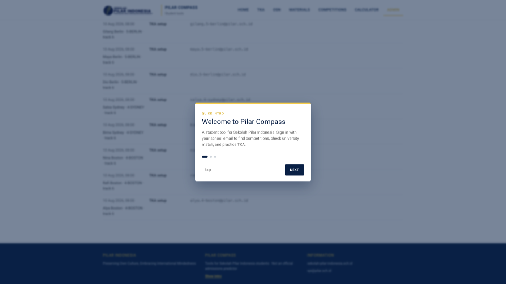

Switch **EN / ID** in the top bar. Most labels follow the language toggle; competition names stay official.

## 3. Home

Home is the launch pad: TKA, OSN, school materials, competitions, and the university match calculator.

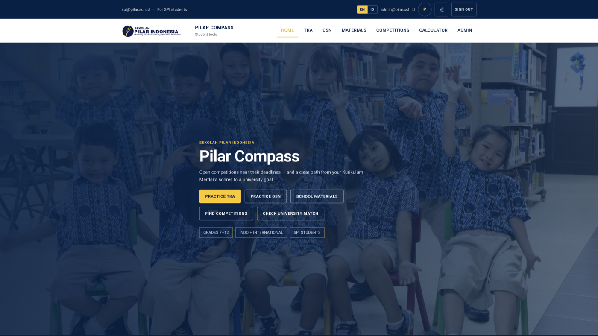

The **Admin** item in the nav only appears when you signed in as the admin email.

## 4. Practice TKA

**Tes Kemampuan Akademik** practice, grouped by track (Grade 6 / 9 / 12). Higher tracks can review lower-grade banks.

1. Open **TKA**.
2. Pick a track card (for example SMA / Grade 12).
3. Open a subject (Mathematics, Indonesian, English, or electives).
4. Start a **lesson** for one skill, or a **tryout** paper when it is not marked coming soon.
5. Open **Leaderboard** from the TKA hub to see class XP and streaks.

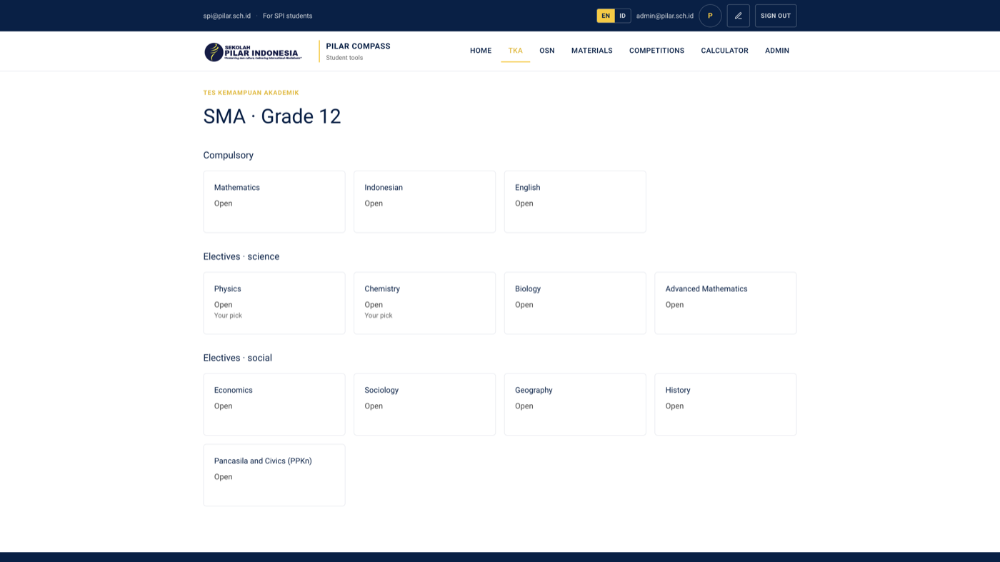

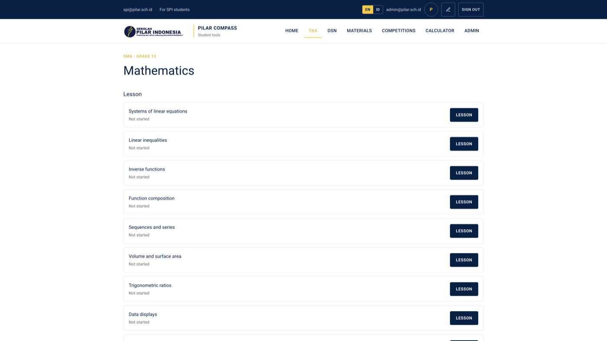

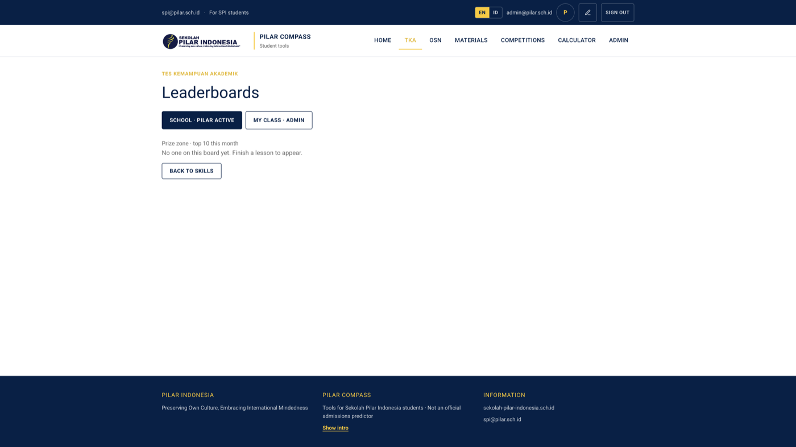

Progress (lessons, streaks, XP) is saved locally in `data/tka-store.json`, or in Postgres if you set `DATABASE_URL`.

## 5. Practice OSN

National Science Olympiad papers for SD, SMP, and SMA, plus official Puspresnas PDF banks.

1. Open **OSN**.
2. Choose a level your track can see (admin / Grade 12 sees all three).
3. Pick a subject, then open a past paper.
4. Answer and score like a TKA tryout. Official PDFs open on the ministry site.

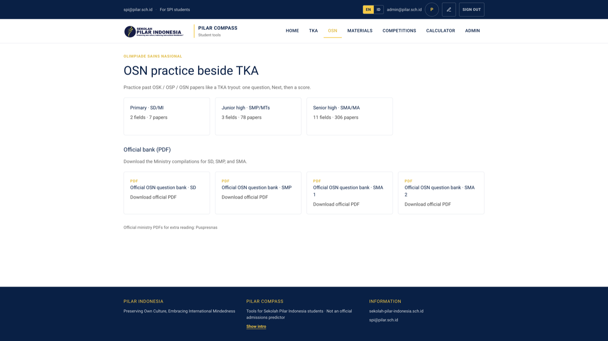

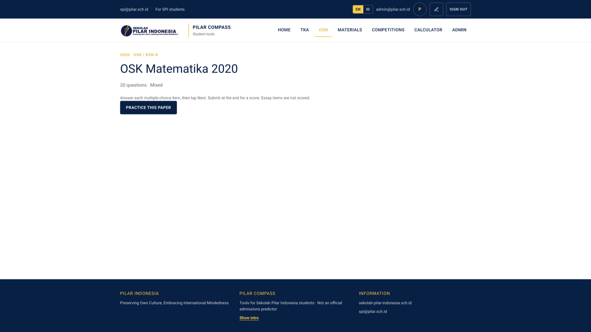

Refresh the archive locally with `npm run osn:scrape` (see [SELF_HOSTING.md](SELF_HOSTING.md)).

## 6. School materials

Official textbooks for grades 4–12 from [SIBI Kemendikdasmen](https://buku.kemendikdasmen.go.id/). PDFs stay on the ministry site; this app only lists them.

1. Open **Materials**.
2. Pick a grade, then a subject.
3. Filter by Kurikulum Merdeka / K-13, student / teacher, umum / SMK.
4. Open the book on SIBI.

Refresh the catalog with `npm run materi:scrape`.

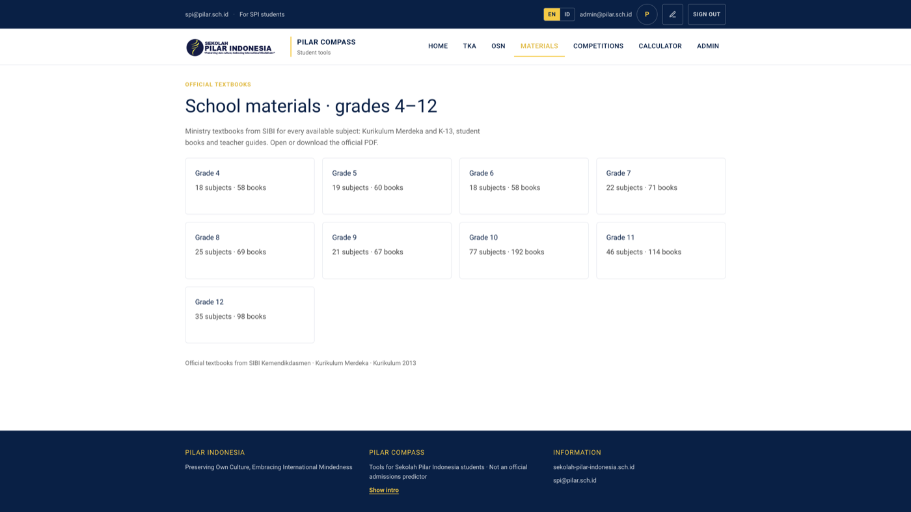

## 7. Competitions

Official Puspresnas *ajang talenta* (OSN, OPSI, FIKSI, LKS, FLS3N, debate, and other academic events). Sports (O2SN) are out of scope.

1. Open **Competitions**.
2. Filter by field, Indonesia vs international, or search by name.
3. Default sort is **still open, nearest deadline first**.
4. Open the announcement or BPTI registration link on the card.

If the ministry site is down, the app uses the last saved snapshot. Refresh with `npm run competitions:scrape`.

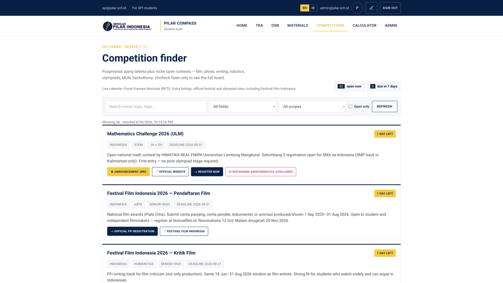

## 8. University match calculator

Enter Kurikulum Merdeka scores (or upload a report photo for OCR), pick a target university, and get a **transparent match %** plus a short roadmap.

1. Open **Calculator**.
2. Edit subject scores (0–100). Add or remove rows as needed.
3. Choose university, country, affordability, and age.
4. Optional: TOEFL / SAT / IELTS, intended major, competition awards.
5. Submit to see the percentage, factor breakdown, and next steps.

This is an illustrative heuristic with visible weights — **not** an official admissions prediction.

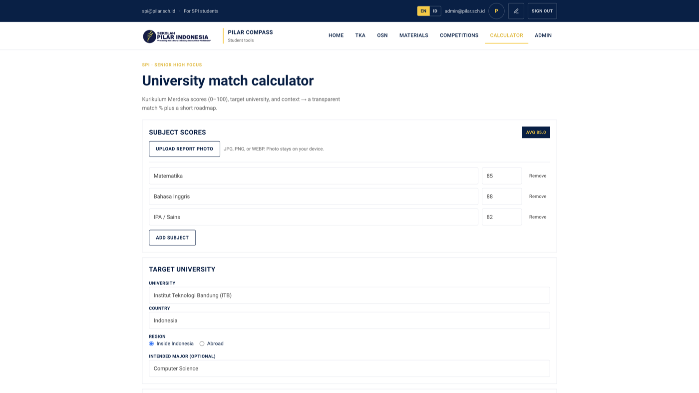

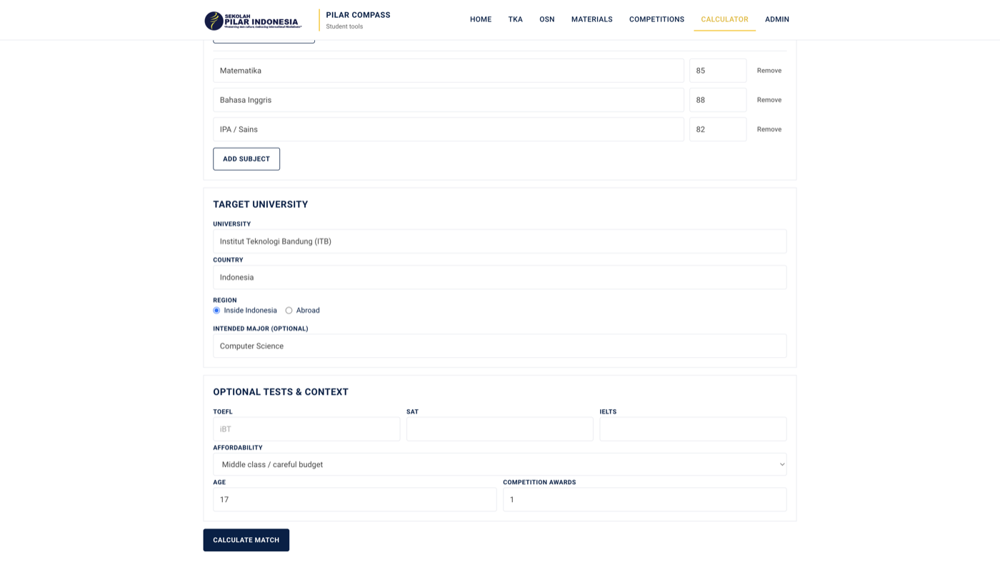

## 9. Profile

Open the avatar or pencil in the top bar. Students can edit display name, class, electives, and photo. Sign out from the same bar.

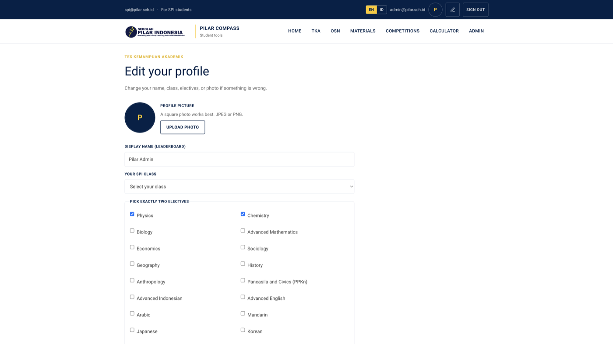

## 10. Admin dashboard

Sign in as `admin@pilar.sch.id` (or the admin email you set in `src/config/school.ts`). You land on **Admin**.

You will see:

- School snapshot KPIs
- Last 14 days of TKA activity (WIB)
- Event mix and pages visited
- Homerooms for every SPI class — expand a class for the roster
- Skills practiced and tryout papers
- Activity feed

Demo homerooms are always present so every class has a roster. Real TKA progress is merged on top when students study.

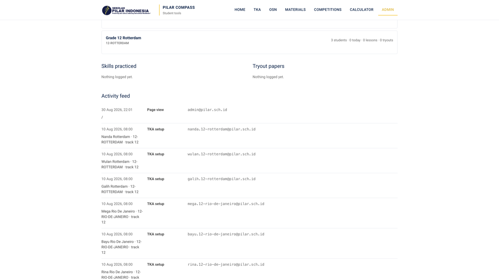

## Honesty notes

- Competition openness is date logic on curated / scraped public data.
- Match % is a weighted heuristic, not SNBP / SNBT / overseas admissions.
- OCR can misread a report photo — always edit the scores before you trust them.
